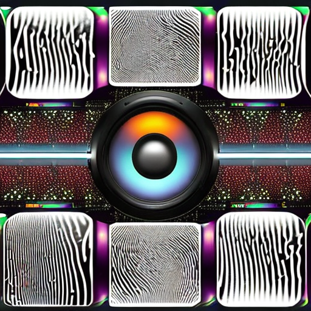

# Music and Image Search

This project implements a music search algorithm inspired by the strategy of Shazam and an image search algorithm utilizing SIFT features. The goal of this project is to develop fast and accurate algorithms for searching music and images, providing efficient solutions for audio and visual content retrieval.



## Features

- **Music Search:** The music search algorithm uses a constellation algorithm similar to Shazam. It analyzes audio fingerprints to identify songs based on their unique audio patterns. The algorithm efficiently matches and retrieves music tracks from a database, providing accurate results even in noisy environments.

- **Image Search:** The image search algorithm utilizes SIFT (Scale-Invariant Feature Transform) features to detect and match key visual features in images. It extracts distinctive local features, such as edges, corners, and textures, and performs efficient image matching and retrieval. This enables users to search for similar images based on their visual characteristics.

- **Fast and Accurate Results:** Both the music and image search algorithms have been optimized to deliver fast and accurate results. Extensive algorithm optimizations and data structures have been implemented to enhance the efficiency of the search process, ensuring quick response times while maintaining high accuracy.

- **Code Samples:** The project provides code samples that demonstrate the implementation of the music and image search algorithms. These code samples serve as a valuable resource for understanding the underlying principles and can be used as a starting point for further development or customization.

## Installation

To run the project locally, follow these steps:

1. Clone the repository:

   ```bash
   git clone https://github.com/github.com/Muhammad0Awais/Music-Shazam-and-Images-retrieval-SIFT
   ```

2. Install the required dependencies. The project may have specific library requirements, so it's recommended to set up a virtual environment before installing the dependencies.

3. Run the application using your preferred Python environment or IDE.

## Usage

1. Music Search:

   - Prepare an audio sample or input a recording.
   - Pass the audio sample to the music search algorithm.
   - The algorithm will analyze the audio fingerprints and search for matches in the music database.
   - Retrieve the matched music tracks and relevant information.

2. Image Search:

   - Provide an image or specify an image URL.
   - Feed the image to the image search algorithm.
   - The algorithm will extract SIFT features and compare them with the features of images in the database.
   - Retrieve the similar images based on visual similarity.

3. Code Samples:

   - Explore the provided code samples in the repository to understand the implementation details of the music and image search algorithms.
   - Modify and adapt the code as needed for your specific use cases.

## Contributing

Contributions to the project are welcome! If you have any ideas, suggestions, or improvements, please submit a pull request. Ensure that your code adheres to the project's coding conventions and follows good software development practices.

## License

This project is licensed under the [MIT License](LICENSE). Feel free to use, modify, and distribute this code for personal or commercial purposes.

## Acknowledgements

- The music search algorithm was inspired by the strategy of Shazam and related research in audio fingerprinting.
- The image search algorithm utilizes the SIFT (Scale-Invariant Feature Transform) algorithm for keypoint detection and matching.

## Contact

For any inquiries or further information about the project, please contact [Ch Muhammad Awais](mailto:awaisrwp@yahoo.com).
